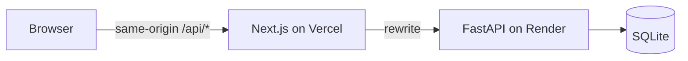
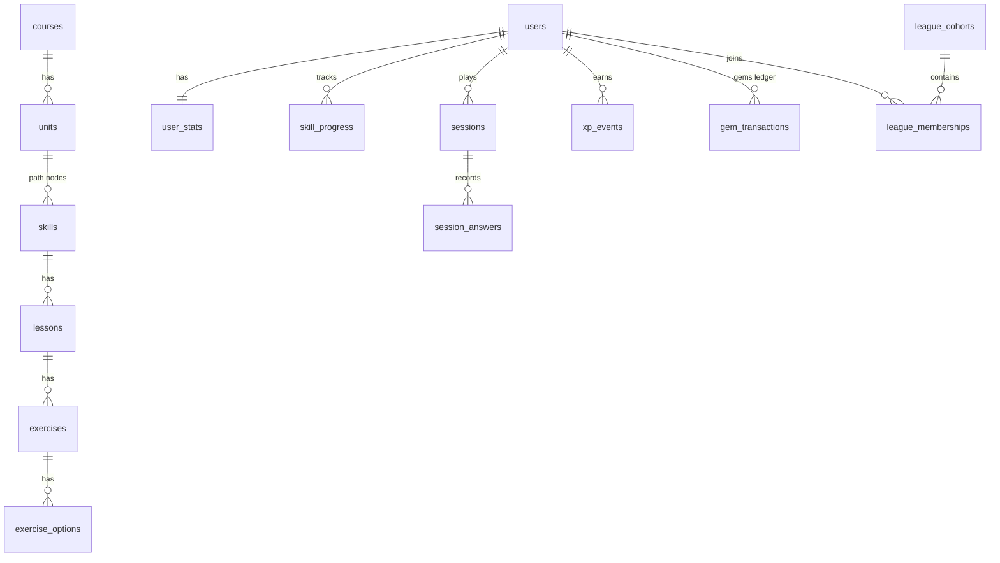

# Duolingo Web App

A full-stack clone of the Duolingo web app. It recreates the learning path, the lesson player with its
varied exercises, and the gamification loop: XP, streaks, hearts, gems, leagues and achievements.
It is built with **Next.js (TypeScript)**, **FastAPI** and **SQLite**.

> Educational clone; not affiliated with Duolingo. The Duolingo name, fonts, icons, artwork and
> animations belong to Duolingo and are used only to reproduce its look. The course sentences,
> the sound effects and the remaining drawings (the owl's poses, the lesson characters) are
> original.

**Live demo:** https://duolingo-seven-ecru.vercel.app · **API:** https://duolingo-web-app-9qs3.onrender.com (interactive docs at [`/api/docs`](https://duolingo-web-app-9qs3.onrender.com/api/docs))

**Log in as a sample learner and explore the path**


**A lesson: a miss costs a heart, then lesson complete, streak and daily goal**


**Leaderboard, quests, shop and profile**


**Dark mode on a phone**


## Features

| Area | What works |
|---|---|
| Login | Duolingo-style login page with the four sample learners in a 2x2 grid; one click logs in with a signed, HttpOnly session cookie; log out from Settings |
| Learning path | Units with sticky banners, nodes that unlock in order (locked / active / completed / legendary), progress rings, crowns per skill, node popovers, treasure chests, animated Duolingo characters beside the path (still and grey in locked units), the first node of each locked unit offering "Jump here?" |
| Top bar | Course flag, streak, total XP, gems and hearts, each with a popover that opens on hover or tap: week calendar, daily goal progress, shop link, next-heart timer and refill |
| Right rail | Varies by page like the original: Super promo, league and daily quests by default; friends cards on Profile; the monthly challenge on Quests; no Super promo on the Shop |
| Lesson player | Multiple choice, picture choice, translate with a word bank, match pairs, fill in the blank, type the answer, listen and type, and speaking (a placeholder that is skipped without penalty); word hints on the Spanish words of a sentence; server-graded answers with typo and accent tolerance, the feedback bar, progress bar, combo counter and re-asked mistakes; an animated loading screen while a session starts |
| Hearts | Up to 10; lose one per mistake in lessons and reviews; regenerate one every 5 hours; refill with gems; practise to earn hearts; out-of-hearts modal |
| Streak | Extends on the first completed session of each local day, streak freezes, week calendar, celebration screen |
| Daily goal | 1/10/20/30/50 XP goals; progress in the XP popover, the right rail and on Quests; a gem chest when reached |
| Leagues | Weekly Bronze to Diamond leagues of 30, shared by every learner in the same league and week and topped up with rivals whose XP accrues live; promotion and demotion zones, weekly results |
| Profile | Streak, total XP, league, top-3 finishes and six achievements with levels |
| Shop | Heart refill and streak freezes paid with (mocked) gems; the top banner rotates between the family plan and a Super free trial, both "Coming soon" |
| Settings | Sound effects, animations, motivational messages, listening exercises, dark mode, daily goal, courses |
| Bonus | Text-to-speech audio, achievements, a live leaderboard shared by the sample learners, legendary challenges on completed skills, timed practice in the Practice hub, dark mode, responsive layouts from 320px phones to wide monitors |
| Demo tools | Simulate the passing of time (+1 hour, +5 hours, +1 day, next Monday) and reset the demo data |

Placeholders shown as "Coming soon": speech recognition, purchases, Super and the family plan,
friends, jumping ahead to a locked unit, other courses, and the profile, notifications and privacy
settings. Authentication is simplified: the login page lists the sample learners and you log in as
one with a click; signing up and the email and password form answer "Coming soon".

## Sample data

The seed creates one course, Spanish for English speakers: 3 units of 6 path nodes each (4 lesson
skills, a treasure chest and a unit review), 39 lessons and 405 exercises across eight exercise
types. Five more courses are listed as "Coming soon". It also creates four sample learners at
different stages, each with a full set of 10 hearts:

| Learner | Stage |
|---|---|
| **Parth Biyani** (@parthbiyani) | Unit 1 complete with one legendary skill, Unit 2 under way, a 12-day streak, 1,240 XP, 500 gems, Silver league |
| **Ananya Iyer** (@ananyaiyer) | Signed up last night: the very start of Unit 1, 0 XP, no streak, 50 gems, leaderboard still locked |
| **Isha Nair** (@ishanair) | Halfway through Unit 1, a 4-day streak, 205 XP, 320 gems, Silver league (promoted last week) |
| **Kabir Malhotra** (@kabirmalhotra) | Deep in Unit 3, a 64-day streak, 4,120 XP, two legendary skills, 950 gems, Silver league (demoted from Gold last week) |

Parth, Isha and Kabir are in the same Silver league this week, so they share one live leaderboard:
the three of them plus 27 rivals. Log in as any of them to see the same standings with your own
row highlighted; XP earned in a lesson moves that learner up everyone's table straight away, and
the rivals keep earning XP through the day. Ananya joins a league once she has finished 10 lessons:
the open one for her tier and week if it has a rival's seat to give, otherwise a new one.

Each history (XP ledger, daily activity, streaks, gems, skill progress, achievements and league
finishes) is generated relative to the current date from a short profile in
`backend/app/seed/learners.py`, so the app is ready to use straight after seeding.

## Tech stack

| Layer | Choice |
|---|---|
| Frontend | Next.js 16 (App Router), React 19, TypeScript (strict), Tailwind CSS v4, TanStack Query, Motion, Radix primitives |
| Backend | FastAPI, SQLAlchemy 2, Alembic, Pydantic v2, Uvicorn, Python 3.13 managed by uv |
| Database | SQLite (WAL mode, foreign keys enforced) |
| Testing | pytest, Vitest and Testing Library, Playwright |
| Tooling | ruff, mypy (strict), ESLint, Prettier, pre-commit, GitHub Actions |
| Hosting | Vercel (frontend) and a Render web service (API + SQLite) |

## Architecture



- **The API is the single source of truth.** It grades answers on the server; exercises are sent
  without their answers. Hearts, XP, streaks and gems only change there.
- **Rules are pure functions.** They live in `backend/app/domain`, are evaluated against an injectable
  clock, and are settled lazily on every request, so the app needs no background jobs.
- **Ledgers are the source of truth** for XP and gems. Totals are cached in the same transaction as
  each ledger write.
- **One auth seam.** Logging in sets a `duo_session` cookie (the username signed with HMAC-SHA256
  under `SECRET_KEY`). The API resolves the learner from it in a single dependency, and the
  frontend's `src/proxy.ts` sends visitors without it to `/login`.

More detail: [architecture](docs/architecture.md), [game rules](docs/game-rules.md) and the
[decision records](docs/adr).

## Database schema

23 tables in five groups: course content, learners, sessions, ledgers, and the gamification
catalogue. The full ER diagram and table notes are in [docs/database.md](docs/database.md).



## API overview

The base path is `/api/v1`. Errors are RFC 9457 problem details:
`{type, title, status, detail, code}`. Interactive docs are at `/api/docs`. Every route except
`/auth/*`, `/demo/*` and the health check needs the session cookie and answers `401`
(`not_authenticated`) without a valid one.

| Method and path | Purpose |
|---|---|
| `GET /auth/learners` · `POST /auth/login` · `POST /auth/logout` | Sample learners, log in as one (sets the session cookie), log out |
| `GET /me` · `PATCH /me` · `PATCH /me/settings` | Learner and settled stats; daily goal or time zone; preferences |
| `GET /courses/current/path` | Units and nodes with the learner's state |
| `POST /skills/{id}/chest` | Open a treasure chest node |
| `POST /sessions` | Start a lesson, practice, review, legendary or timed session (exercises carry word hints, never answers) |
| `POST /sessions/{id}/answers` | Grade one answer (idempotent per `answer_id`) |
| `POST /sessions/{id}/complete` | Award XP, streak, goal, progress and achievements (idempotent) |
| `POST /sessions/{id}/abandon` | Quit a session |
| `POST /hearts/refill` · `GET /shop` · `POST /shop/purchases` | Gem spending |
| `GET /leaderboard` · `GET /profile` · `GET /quests` | League standings, statistics, daily goal quest |
| `GET /demo/clock` · `POST /demo/clock/advance` · `POST /demo/reset` | Demo tools; `404` unless `DEMO_TOOLS=true` |
| `GET /api/health` | Health check (outside `/api/v1`) |

## Getting started

Prerequisites: **Node.js 24**, **Python 3.13** and [**uv**](https://docs.astral.sh/uv/).

```bash
# Backend: http://127.0.0.1:8000 (docs at /api/docs)
cd backend
uv sync
cp .env.example .env            # DEMO_TOOLS=true enables the time simulator
uv run alembic upgrade head
uv run python -m app.seed --if-empty
uv run uvicorn app.main:app --reload --port 8000

# Frontend: http://localhost:3000, proxying /api to the backend
cd frontend
npm ci
npm run dev
```

Open http://localhost:3000. You land on the login page; pick a sample learner. To put every learner
back to its starting state, use Settings → Demo tools → Reset demo data, or run
`uv run python -m app.seed --reset`.

## Configuration

| Variable | App | Default | Purpose |
|---|---|---|---|
| `DATABASE_URL` | backend | `backend/data/app.db` | SQLite file; on a host with a persistent disk, an absolute path on that disk |
| `APP_ENV` | backend | `development` | `development`, `test` or `production` (`production` marks the cookie `Secure`) |
| `DEMO_TOOLS` | backend | off | Enables the simulated clock and data reset (`/api/v1/demo/*`) |
| `LOG_LEVEL` | backend | `info` | Log level |
| `SECRET_KEY` | backend | a development key | Signs the session cookie; must be set to a long random value in production (the API logs a warning when it is not) |
| `API_ORIGIN` | frontend | `http://127.0.0.1:8000` | Where `/api/*` is proxied; required for Vercel production builds; stray spaces, quotes and trailing slashes are ignored |
| `NEXT_PUBLIC_DEMO_TOOLS` | frontend | on | Set to `false` to hide the Demo tools section |

Deployment to Vercel and Render is described in [docs/deployment.md](docs/deployment.md).

## Testing

```bash
cd backend && uv run pytest --cov=app        # unit tests (rules) and API integration tests
cd frontend && npm run test                  # unit and component tests (Vitest)
cd frontend && npx playwright install chromium && npm run test:e2e   # end-to-end tests
```

The end-to-end suite starts its own API on port 8100 and a production build of the frontend on
port 3100, so it can run next to the development servers.

CI runs lint, type checks, unit and integration tests and the production build for both apps on
every pull request.

## Demo tools

Settings → **Demo tools** moves the server's clock, so you can watch day-based rules play out:
- **+1 day**, then finish a lesson: the streak extends.
- **+5 hours**: a heart regenerates.
- **Next Monday**: the league week rolls over. Learners promoted or demoted together share their
  new league too.
- **Reset demo data**: restores all four sample learners.

## Assumptions

- **Sample learners instead of accounts.** Authentication is simplified. The login page lists the
  four sample learners and a click logs in as one, with a signed, HttpOnly session cookie; there
  are no passwords and sign-up is "Coming soon". Every visitor who picks the same learner shares
  their progress; use "Reset demo data" to start over.
- **Gems are mocked.** There are no real purchases.
- **Game rules** (XP, hearts, streak, leagues) follow Duolingo's documented rules where they are public.
  Where they aren't, sensible values are documented in [docs/game-rules.md](docs/game-rules.md).
- **Course content** is a small original Spanish course: 3 units, 12 lesson skills, 405 exercises.
  Audio uses the browser's speech synthesis.
- **The live demo's data is not permanent.** The API runs on Render's free plan, which has no
  persistent disk, so the database is recreated from the seed after a redeploy or when the idle
  service spins down. See [docs/deployment.md](docs/deployment.md).

## Project structure

```
backend/   FastAPI app: api (routes), services (use cases), domain (pure rules), models, seed, migrations, tests
frontend/  Next.js app: app (routes), features (screens), components (UI, shell, icons, mascot), lib (API client, sound, speech), proxy.ts (login redirect), public/duo (artwork)
docs/      architecture, database, game rules, deployment, decision records
```

## License and credits

- The code is [MIT](LICENSE).
- The fonts are Duolingo's own typefaces (Duolingo Sans and Feather), included only to reproduce the
  original look in this educational clone. They remain Duolingo's property.
- Icons, artwork and Lottie animations (the path characters and the loading-screen owl) in
  `frontend/public/duo` are Duolingo's, used only to reproduce the original look.
- The owl's poses on other screens and the lesson characters are original SVG drawings. Picture
  cards use the device's emoji font, and sound effects are synthesised in the browser.
