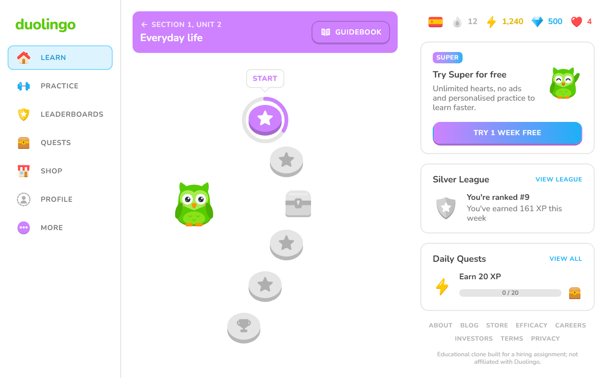
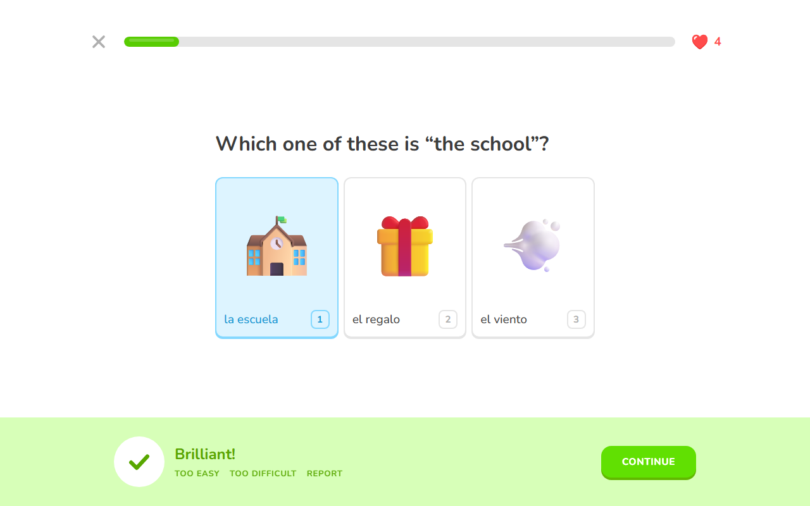
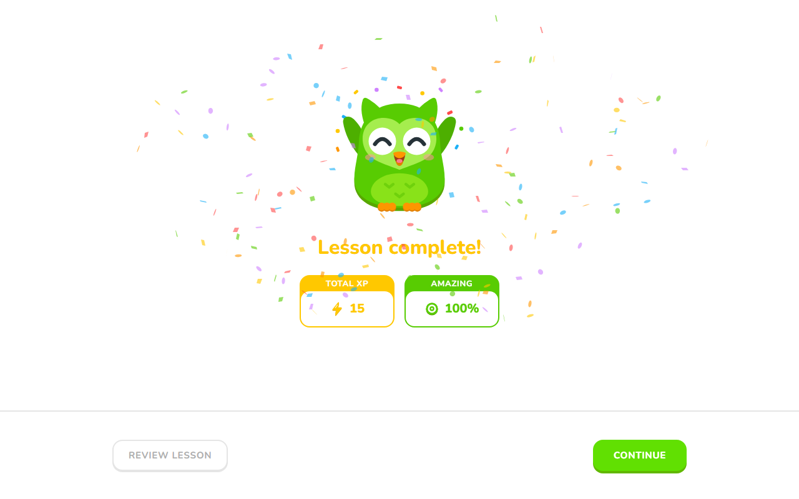
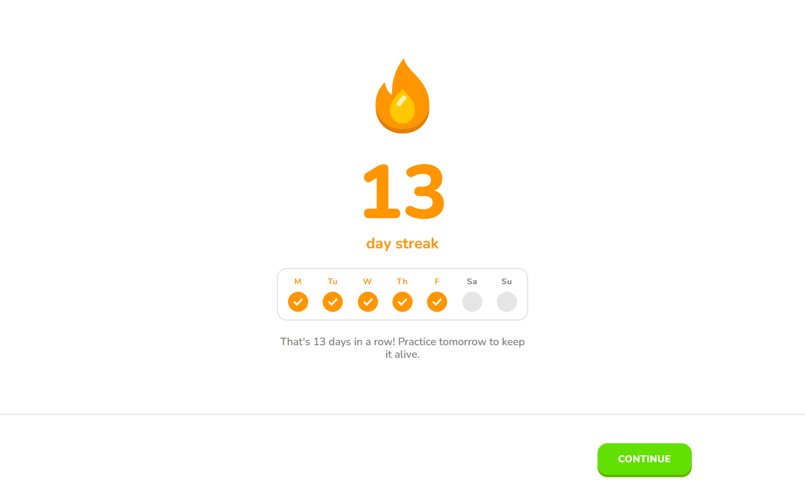
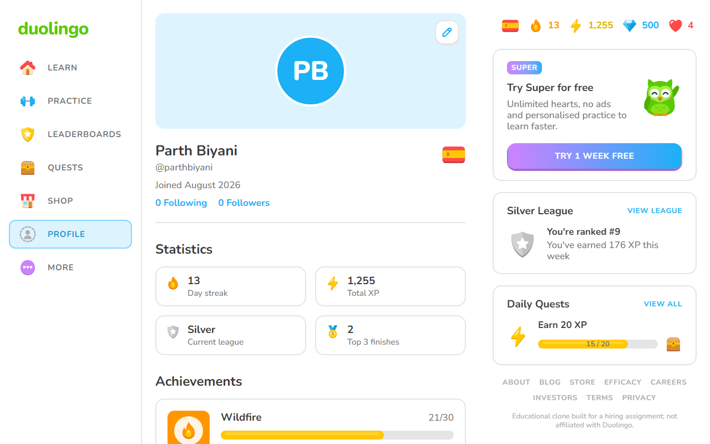
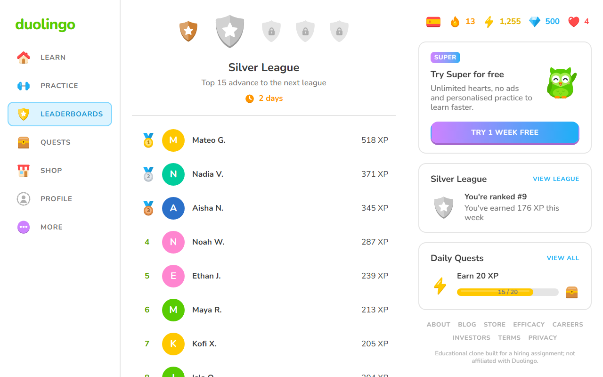
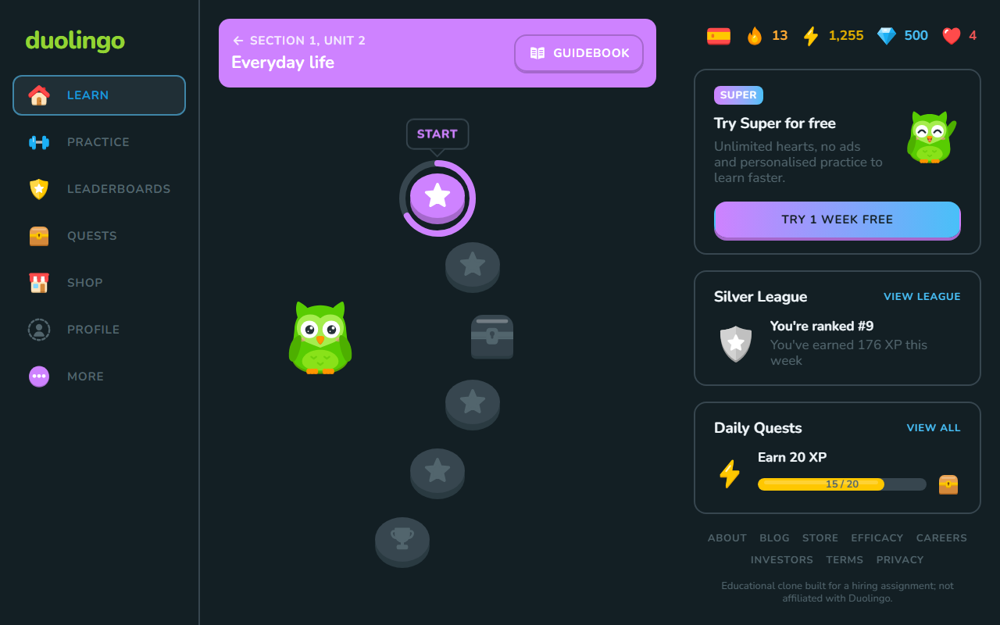
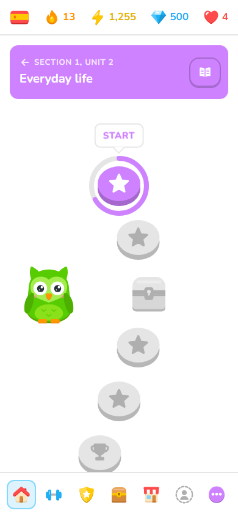
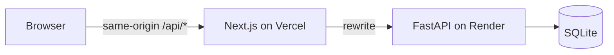
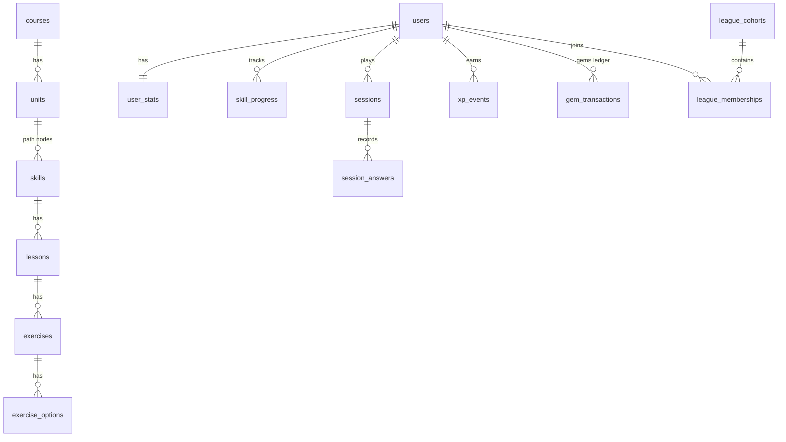

# Duolingo Web App

A full-stack clone of the Duolingo web app. It recreates the learning path, the lesson player with its
varied exercises, and the gamification loop: XP, streaks, hearts, gems, leagues and achievements.
It is built with **Next.js (TypeScript)**, **FastAPI** and **SQLite**.

> Educational clone built for a hiring assignment; not affiliated with Duolingo. The Duolingo name,
> fonts, icons and artwork belong to Duolingo and are used only to reproduce its look for this
> assignment. The course sentences and sound effects are original.

**Live demo:** https://duolingo-seven-ecru.vercel.app · **API:** https://duolingo-web-app-9qs3.onrender.com (interactive docs at [`/api/docs`](https://duolingo-web-app-9qs3.onrender.com/api/docs))

| Learning path | Lesson and feedback bar |
|---|---|
|  |  |

| Lesson complete | Streak extended |
|---|---|
|  |  |

| Profile and achievements | League leaderboard |
|---|---|
|  |  |

| Dark mode | Phone |
|---|---|
|  |  |

## Features

| Area | What works |
|---|---|
| Learning path | Units with sticky banners, nodes that unlock in order (locked / active / completed / legendary), progress rings, crowns per skill, node popovers, treasure chests |
| Top bar | Course flag, streak, total XP, gems and hearts, each with a popover: week calendar, daily goal progress, shop link, next-heart timer and refill |
| Lesson player | Multiple choice, picture choice, translate with a word bank, match pairs, fill in the blank, type the answer, listen and type; server-graded answers with the signature feedback bar, progress bar, combo counter, re-asked mistakes |
| Hearts | Lose one per mistake; regenerate one every 5 hours; refill with gems; practise to earn hearts; out-of-hearts modal |
| Streak | Extends on the first lesson of each local day, streak freezes, week calendar, celebration screen |
| Daily goal | 1/10/20/30/50 XP goals; progress in the XP popover, the right rail and on Quests; a gem chest when reached |
| Leagues | Weekly Bronze to Diamond leagues with 29 seeded rivals whose XP accrues live, promotion and demotion zones |
| Profile | Streak, total XP, league, top-3 finishes and six achievements with levels |
| Shop | Heart refill and streak freezes paid with (mocked) gems |
| Settings | Sound effects, animations, motivational messages, listening exercises, dark mode, daily goal |
| Bonus | Text-to-speech audio, achievements, a working leaderboard across seeded learners, legendary challenges on completed skills, timed practice in the Practice hub, dark mode, responsive layouts from 320px phones to wide monitors |
| Demo tools | Simulate the passing of time (+1 hour, +5 hours, +1 day, next week) and reset the demo data |

Placeholders, as the assignment allows: speech recognition, purchases and Super, friends, and other
languages are shown as "Coming soon". Authentication is simplified: the login page lists the sample
learners and you log in as one with a click; signing up and passwords are "Coming soon".

## Sample data

The seed creates one course, Spanish for English speakers: 3 units, 12 skills and 405 exercises
across eight exercise types. It also creates four sample learners at different stages, each with a
full set of 10 hearts and their own league cohort among 29 seeded rivals:

| Learner | Stage |
|---|---|
| **Parth Biyani** (@parthbiyani) | Unit 1 complete with one legendary skill, Unit 2 under way, a 12-day streak, 1,240 XP, 500 gems, Silver league |
| **Zoe Fernandes** (@zoefernandes) | Signed up last night: the very start of Unit 1, 0 XP, no streak, 50 gems, leaderboard still locked |
| **Isha Nair** (@ishanair) | Halfway through Unit 1, a 4-day streak, 205 XP, 320 gems, Bronze league |
| **Kabir Malhotra** (@kabirmalhotra) | Deep in Unit 3, a 64-day streak, 4,120 XP, two legendary skills, 950 gems, Gold league |

Each history (XP ledger, daily activity, streaks, gems, skill progress, achievements and league
finishes) is generated relative to the current date from a short profile in
`backend/app/seed/learners.py`, so the app is ready to use straight after seeding.

## Tech stack

| Layer | Choice |
|---|---|
| Frontend | Next.js 16 (App Router), React 19, TypeScript (strict), Tailwind CSS v4, TanStack Query, Motion, Radix primitives |
| Backend | FastAPI, SQLAlchemy 2, Alembic, Pydantic v2, Uvicorn, Python 3.13 managed by uv |
| Database | SQLite (WAL mode, foreign keys enforced) |
| Testing | pytest, Vitest and Testing Library |
| Tooling | ruff, mypy (strict), ESLint, Prettier, pre-commit, GitHub Actions |
| Hosting | Vercel (frontend) and Render with a persistent disk (API + SQLite) |

## Architecture



- **The API is the single source of truth.** It grades answers on the server; exercises are sent
  without their answers. Hearts, XP, streaks and gems only change there.
- **Rules are pure functions.** They live in `backend/app/domain`, are evaluated against an injectable
  clock, and are settled lazily on every request, so the app needs no background jobs.
- **Ledgers are the source of truth** for XP and gems. Totals are cached in the same transaction as
  each ledger write.

More detail: [architecture](docs/architecture.md), [game rules](docs/game-rules.md) and the
[decision records](docs/adr).

## Database schema

23 tables in five groups: course content, learners, sessions, ledgers, and the gamification
catalogue. The full ER diagram and table notes are in [docs/database.md](docs/database.md).



## API overview

The base path is `/api/v1`. Errors are RFC 9457 problem details:
`{type, title, status, detail, code}`. Interactive docs are at `/api/docs`.

| Method and path | Purpose |
|---|---|
| `GET /auth/learners` · `POST /auth/login` · `POST /auth/logout` | Sample learners, log in as one (sets the session cookie), log out |
| `GET /me` · `PATCH /me` · `PATCH /me/settings` | Learner, settled stats, daily goal, preferences |
| `GET /courses/current/path` | Units and nodes with the learner's state |
| `POST /skills/{id}/chest` | Open a treasure chest node |
| `POST /sessions` | Start a lesson, practice, review, legendary or timed session |
| `POST /sessions/{id}/answers` | Grade one answer (idempotent per `answer_id`) |
| `POST /sessions/{id}/complete` | Award XP, streak, goal, progress and achievements (idempotent) |
| `POST /sessions/{id}/abandon` | Quit a session |
| `POST /hearts/refill` · `GET /shop` · `POST /shop/purchases` | Gem spending |
| `GET /leaderboard` · `GET /profile` · `GET /quests` | League standings, statistics, daily goal quest |
| `GET /demo/clock` · `POST /demo/clock/advance` · `POST /demo/reset` | Demo tools, enabled with `DEMO_TOOLS=true` |
| `GET /api/health` | Health check |

## Getting started

Prerequisites: **Node.js 24**, **Python 3.13** and [**uv**](https://docs.astral.sh/uv/).

```bash
# Backend: http://127.0.0.1:8000 (docs at /api/docs)
cd backend
uv sync
cp .env.example .env            # DEMO_TOOLS=true enables the time simulator
uv run alembic upgrade head
uv run python -m app.seed --if-empty
uv run uvicorn app.main:app --reload --port 8000

# Frontend: http://localhost:3000, proxying /api to the backend
cd frontend
npm ci
npm run dev
```

## Configuration

| Variable | App | Default | Purpose |
|---|---|---|---|
| `DATABASE_URL` | backend | `backend/data/app.db` | SQLite file; use an absolute path on a persistent disk in production |
| `APP_ENV` | backend | `development` | `development`, `test` or `production` |
| `DEMO_TOOLS` | backend | off | Enables the simulated clock and data reset (`/api/v1/demo/*`) |
| `LOG_LEVEL` | backend | `info` | Log level |
| `SECRET_KEY` | backend | a development key | Signs the session cookie; set a long random value in production |
| `API_ORIGIN` | frontend | `http://127.0.0.1:8000` | Where `/api/*` is proxied; required for production builds |
| `NEXT_PUBLIC_DEMO_TOOLS` | frontend | on | Set to `false` to hide the Demo tools section |

Deployment to Vercel and Render is described in [docs/deployment.md](docs/deployment.md).

## Testing

```bash
cd backend && uv run pytest --cov=app        # unit tests (rules) and API integration tests
cd frontend && npm run test                  # unit and component tests
```

CI runs lint, type checks, tests and the production build for both apps on every pull request.

## Demo tools

Settings → **Demo tools** moves the server's clock, so you can watch day-based rules play out:
- **+1 day**, then finish a lesson: the streak extends.
- **+5 hours**: a heart regenerates.
- **Next Monday**: the league week rolls over.
- **Reset demo data**: restores all four sample learners.

## Assumptions

- **Sample learners instead of accounts.** The assignment allows simplified authentication. The login
  page lists the four sample learners and a click logs in as one, with a signed, HttpOnly session
  cookie; there are no passwords and sign-up is "Coming soon". Every visitor who picks the same
  learner shares their progress; use "Reset demo data" to start over.
- **Gems are mocked.** There are no real purchases.
- **Game rules** (XP, hearts, streak, leagues) follow Duolingo's documented rules where they are public.
  Where they aren't, sensible values are documented in [docs/game-rules.md](docs/game-rules.md).
- **Course content** is a small original Spanish course: 3 units, 12 skills, about 400 exercises.
  Audio uses the browser's speech synthesis.

## Project structure

```
backend/   FastAPI app: api (routes), services (use cases), domain (pure rules), models, seed, migrations, tests
frontend/  Next.js app: app (routes), features (screens), components (UI, icons, mascot), lib (API client, sound, speech)
docs/      architecture, database, game rules, deployment, decision records
```

## License and credits

- The code is [MIT](LICENSE).
- The fonts are Duolingo's own typefaces (Duolingo Sans and Feather), included only to reproduce the
  original look in this educational clone. They remain Duolingo's property.
- Icons and artwork in `frontend/public/duo` are Duolingo's, used only to reproduce the original
  look. Picture cards use the device's emoji font, and sound effects are synthesised in the browser.
