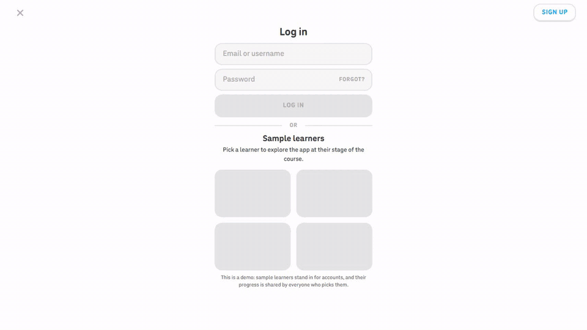
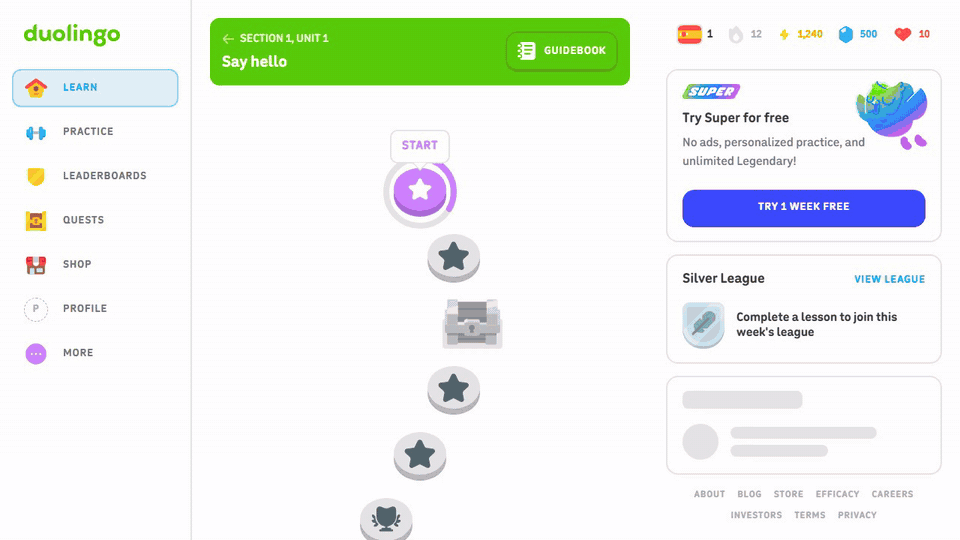
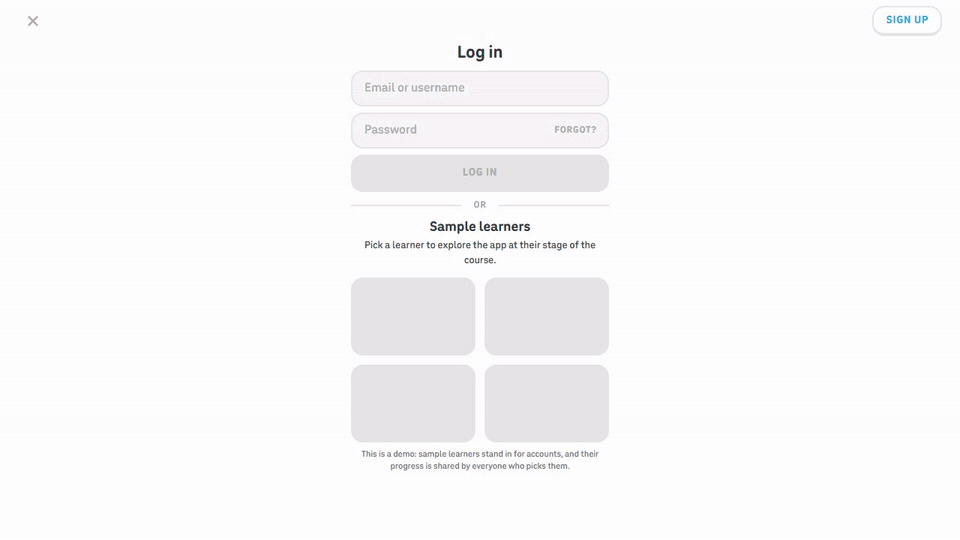
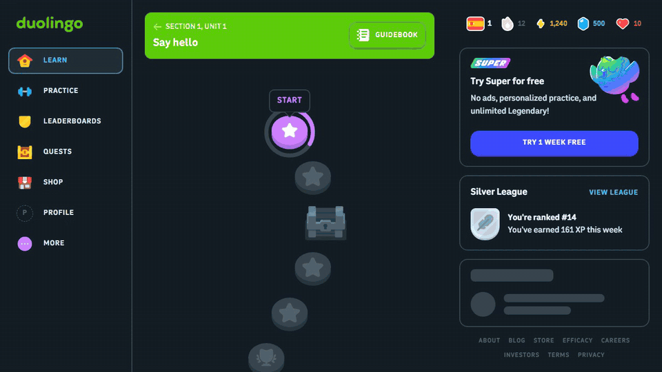
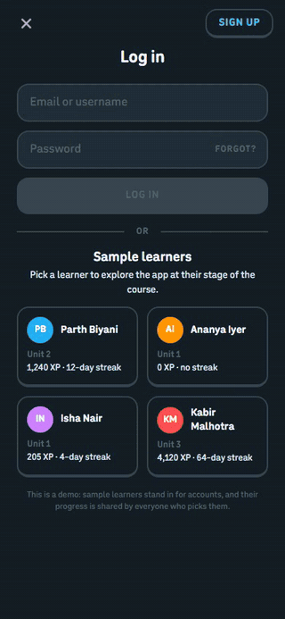
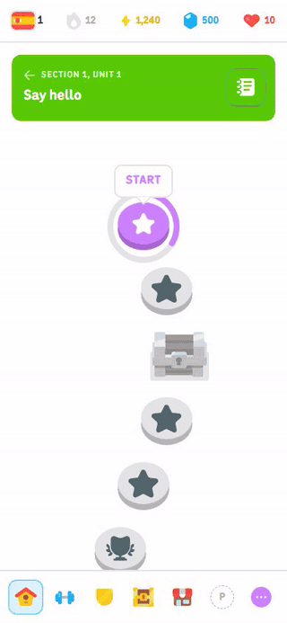
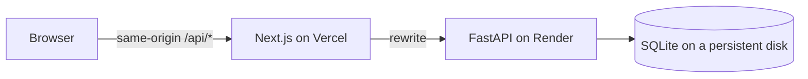
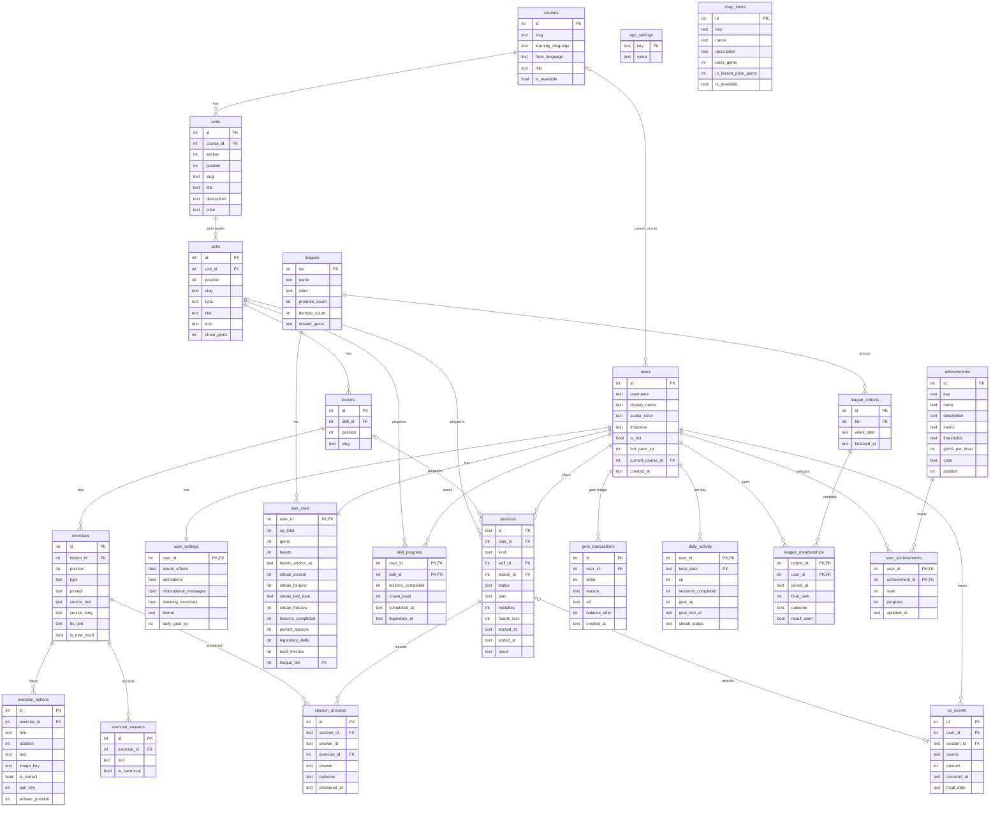

# Duolingo Web App

A full-stack clone of the Duolingo web app: the learning path, a lesson player with eight exercise
types, and the gamification loop of XP, streaks, hearts, gems, leagues and achievements. Built with
**Next.js (TypeScript)**, **FastAPI** and **SQLite**.

> Educational clone; not affiliated with Duolingo. The Duolingo name, fonts, icons, artwork and
> animations belong to Duolingo and are used only to reproduce its look. The course sentences, the
> sound effects and the remaining drawings are original.

| | Link |
|---|---|
| Web app (Vercel) | https://duolingo-seven-ecru.vercel.app |
| API (Render) | https://duolingo-web-app-9qs3.onrender.com |
| Interactive API docs | https://duolingo-web-app-9qs3.onrender.com/api/docs |

| Log in, the streak window and the path | A lesson: a miss, then the celebrations |
|---|---|
|  |  |
| **Leaderboard, quests, shop and profile** | **Dark mode** |
|  |  |

| Phone, dark | Phone, light |
|---|---|
|  |  |

## For reviewers

A five-minute tour of the live app:

1. **Log in as Parth Biyani.** The login page lists four sample learners at different stages; one
   click logs in (sign-up and passwords are "Coming soon").
2. **Play the active lesson** (Unit 2). Miss one answer to see the red feedback bar and lose a heart;
   the missed exercise comes back at the end. Finishing shows lesson complete, the streak going from
   12 to 13 and the daily goal chest.
3. **Open the Leaderboards.** Parth, Isha and Kabir share one live Silver league; log out (More →
   Log out), log in as Isha, play a lesson and watch her move up Parth's table.
4. **Move time** in Settings → Demo tools: **+1 day** then a lesson extends the streak, **+5 hours**
   regenerates a heart, **Next Monday** closes the league week (promotions and gem prizes), and
   **Reset demo data** restores all four learners.
5. **Try the rest:** hover the top-bar stats (VIEW MORE opens the streak calendar), practice,
   legendary and timed challenges, the shop, quests, profile, dark mode and a phone-sized window.

Everything Duolingo has that this clone does not implement is shown and answers "Coming soon":
speech recognition, purchases and Super, friends, jumping ahead to a locked unit, other courses,
and the profile, notifications and privacy settings.

## Features

| Area | What works |
|---|---|
| Learning path | Units with sticky banners, nodes that unlock in order (locked, active, completed, legendary), progress rings, crowns, node popovers, treasure chests, animated characters beside the path |
| Lesson player | Multiple choice, picture choice, word-bank translation, match pairs, fill in the blank, typed answers, listening, speaking (placeholder); word hints, typo and accent tolerance, combo counter, re-asked mistakes, loading screen |
| Hearts | Up to 10; one lost per mistake in lessons and reviews; one regenerates every 5 hours; refill with gems; practise to earn one back; out-of-hearts dialog |
| Streak and daily goal | Extends on the first session of each local day; streak freezes; week strip and month calendar; 1/10/20/30/50 XP goals with a gem chest |
| Leagues | Weekly Bronze to Diamond leagues of 30 with live rival XP, promotion and demotion zones and weekly results |
| Profile and shop | Statistics, six achievements with levels; heart refills and streak freezes paid with mocked gems |
| Settings | Sound effects, animations, motivational messages, listening exercises, dark mode, daily goal |
| Bonus | Text-to-speech, achievements, a real shared leaderboard, legendary and timed practice, dark mode, responsive layouts from 320px phones to wide monitors |

## Decisions worth explaining

- **The server is authoritative.** Exercises reach the browser without their answers; the API grades
  every answer and alone changes hearts, XP, streaks and gems. Answer submission is idempotent per
  `answer_id`, and completing a session twice returns the same frozen result.
- **Rules are pure functions over an injectable clock.** `backend/app/domain` holds hearts, streak,
  XP, league and achievement rules with no I/O. State is settled lazily on every request (hearts
  regenerate, missed days spend freezes, weeks close), so there are no background jobs, and the demo
  clock can jump days ahead.
- **Ledgers are the source of truth.** XP and gems are append-only ledgers (`xp_events`,
  `gem_transactions`); the totals in `user_stats` are caches written in the same transaction, and a
  test asserts they always match.
- **Sample learners instead of accounts.** Logging in sets a `duo_session` cookie (the username
  signed with HMAC-SHA256 under `SECRET_KEY`). One FastAPI dependency resolves the learner and
  `src/proxy.ts` sends visitors without it to `/login`, so real accounts can replace the picker
  without touching the rest. Visitors who pick the same learner share their progress.
- **Leagues are shared cohorts keyed by tier and week.** A learner joins the open cohort for their
  league in place of a rival, so the sample learners compete on one table and learners promoted
  together stay together. Rival XP is generated deterministically per day, so every viewer sees
  the same numbers.
- **SQLite, configured for a web app.** WAL mode, enforced foreign keys, `BEGIN IMMEDIATE` write
  transactions and a single API worker keep writes serialised and safe; constraints (CHECKs, partial
  unique indexes) guard the data, not just the code.
- **Duolingo's own look.** The fonts, icons, artwork and Lottie animations are Duolingo's, measured
  against the live site, because the goal is a faithful clone; game rules follow Duolingo's public
  rules, with the rest written down in [docs/game-rules.md](docs/game-rules.md).

More detail: [architecture](docs/architecture.md), [database](docs/database.md) and the
[decision records](docs/adr).

## Sample data

One course, Spanish for English speakers: 3 units of 6 path nodes (4 lesson skills, a chest and a
unit review), 39 lessons and 405 exercises. Four learners start at different stages, each with
10 hearts; their histories are generated relative to today from `backend/app/seed/learners.py`.

| Learner | Stage |
|---|---|
| **Parth Biyani** (@parthbiyani) | Unit 1 complete with one legendary skill, Unit 2 under way, a 12-day streak, 1,240 XP, 500 gems, Silver league |
| **Ananya Iyer** (@ananyaiyer) | Signed up last night: the start of Unit 1, 0 XP, no streak, 50 gems, leaderboard locked until 10 lessons |
| **Isha Nair** (@ishanair) | Halfway through Unit 1, a 4-day streak, 205 XP, 320 gems, Silver league (promoted last week) |
| **Kabir Malhotra** (@kabirmalhotra) | Deep in Unit 3, a 64-day streak, 4,120 XP, two legendary skills, 950 gems, Silver league (demoted from Gold) |

## Tech stack

| Layer | Choice |
|---|---|
| Frontend | Next.js 16 (App Router), React 19, TypeScript (strict), Tailwind CSS v4, TanStack Query, Motion, Radix primitives |
| Backend | FastAPI, SQLAlchemy 2, Alembic, Pydantic v2, Uvicorn, Python 3.13 managed by uv |
| Database | SQLite (WAL mode, foreign keys enforced) |
| Testing | pytest, Vitest and Testing Library, Playwright with axe |
| Tooling | ruff, mypy (strict), ESLint, Prettier, pre-commit, GitHub Actions |
| Hosting | Vercel (frontend) and a Render web service with a persistent disk (API and SQLite) |



## Database schema

23 tables in five groups: course content, learners, sessions, ledgers, and the league and
achievement catalogue. Table notes are in [docs/database.md](docs/database.md).



## API overview

The base path is `/api/v1`; errors are RFC 9457 problem details (`{type, title, status, detail,
code}`). Every route except `/auth/*`, `/demo/*` and the health check needs the session cookie and
answers `401` without it.

| Method and path | Purpose |
|---|---|
| `GET /auth/learners` · `POST /auth/login` · `POST /auth/logout` | Sample learners, log in as one, log out |
| `GET /me` · `PATCH /me` · `PATCH /me/settings` | Learner and settled stats; daily goal or time zone; preferences |
| `GET /courses/current/path` · `POST /skills/{id}/chest` | Units and nodes with the learner's state; open a chest |
| `POST /sessions` | Start a lesson, practice, review, legendary or timed session (exercises carry hints, never answers) |
| `POST /sessions/{id}/answers` · `/complete` · `/abandon` | Grade one answer; award XP, streak, goal and achievements; quit |
| `POST /hearts/refill` · `GET /shop` · `POST /shop/purchases` | Gem spending |
| `GET /leaderboard` · `GET /profile` · `GET /quests` · `GET /streak/calendar` | League standings, statistics, daily goal quest, a month of streak days |
| `GET /demo/clock` · `POST /demo/clock/advance` · `POST /demo/reset` | Demo tools; `404` unless `DEMO_TOOLS=true` |
| `GET /api/health` | Health check |

## Deploying locally

Prerequisites: **Node.js 24**, **Python 3.13** and [**uv**](https://docs.astral.sh/uv/).

```bash
# Backend: http://127.0.0.1:8000 (docs at /api/docs)
cd backend
uv sync
cp .env.example .env            # DEMO_TOOLS=true enables the time simulator
uv run alembic upgrade head
uv run python -m app.seed --if-empty
uv run uvicorn app.main:app --reload --port 8000

# Frontend: http://localhost:3000, proxying /api to the backend
cd frontend
npm ci
npm run dev
```

| Variable | App | Default | Purpose |
|---|---|---|---|
| `DATABASE_URL` | backend | `backend/data/app.db` | SQLite file (an absolute path on the persistent disk in production) |
| `APP_ENV` | backend | `development` | `production` marks the session cookie `Secure` |
| `SECRET_KEY` | backend | a development key | Signs the session cookie; set a long random value in production |
| `DEMO_TOOLS` | backend | off | Enables the simulated clock and data reset |
| `API_ORIGIN` | frontend | `http://127.0.0.1:8000` | Where `/api/*` is proxied; required for production builds |
| `NEXT_PUBLIC_DEMO_TOOLS` | frontend | on | `false` hides the Demo tools section |

Deployment is described in [docs/deployment.md](docs/deployment.md).

## Testing

```bash
cd backend && uv run pytest --cov=app                                # rules and API integration tests
cd frontend && npm run test                                          # unit and component tests
cd frontend && npx playwright install chromium && npm run test:e2e   # end-to-end tests
```

The Playwright suite drives every feature as the sample learners, at desktop and phone widths, with
an accessibility scan (axe) of each screen. It starts its own API (port 8100, fresh SQLite file) and
a production build (port 3100). CI runs all three suites, linting and type checks on every pull
request.

## Project structure

```
backend/   FastAPI app: api (routes), services (use cases), domain (pure rules), models, seed, migrations, tests
frontend/  Next.js app: app (routes), features (screens), components (UI, shell, icons), lib (API client), e2e (Playwright)
docs/      architecture, database, game rules, deployment, decision records, demo GIFs
```

## License and credits

The code is [MIT](LICENSE). The fonts (Duolingo Sans and Feather), icons, artwork and Lottie
animations in `frontend/public/duo` are Duolingo's property, included only to reproduce the original
look. Picture cards use the device's emoji font and sound effects are synthesised in the browser.
