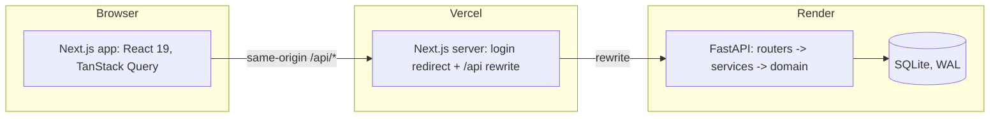
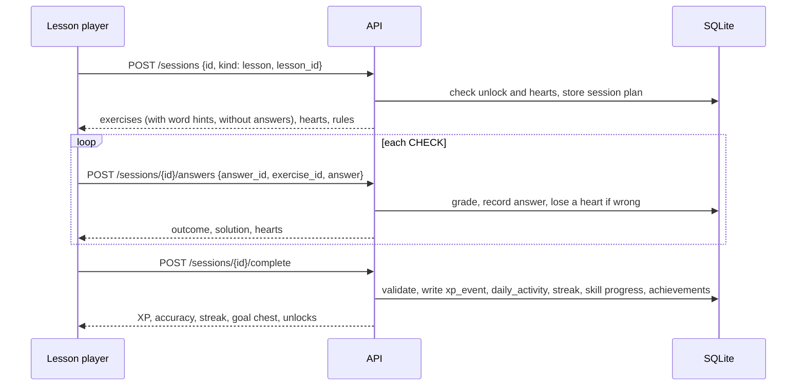

# Architecture

## Overview

- The **frontend** renders every screen and keeps server state in TanStack Query caches.
- The **API** is the single source of truth for game state: it grades answers, and it awards XP, hearts,
  streaks and gems. See [ADR 0002](adr/0002-server-authoritative-grading.md).
- **SQLite** stores course content and learner progress. Ledgers are the source of truth and totals are
  cached. See [ADR 0006](adr/0006-ledgers-and-caches.md).

## Authentication

- `POST /api/v1/auth/login {username}` sets the `duo_session` cookie: the username plus an
  HMAC-SHA256 signature under `SECRET_KEY`. It is `HttpOnly`, `SameSite=Lax`, `Secure` when
  `APP_ENV=production`, and lasts 30 days. There is no session table.
- `get_current_user` (`app/api/deps.py`) is the only place that resolves the learner. It answers
  `401 not_authenticated` when the cookie is missing, forged or names no learner. Every route
  depends on it except `/auth/*`, `/demo/*` and `/api/health`.
- The frontend's `src/proxy.ts` runs before each page: without the cookie it redirects to `/login`,
  and with it `/login` redirects to the app. When the API answers `401`, the app logs out (which
  clears the cookie) and goes back to `/login`.

See [ADR 0003](adr/0003-auth-seam-default-learner.md).

## Backend layers

| Layer | Folder | Responsibility |
|---|---|---|
| API | `app/api/v1` | HTTP routing, request validation (Pydantic), dependency injection (`get_db`, `get_clock`, `get_settings`, `get_current_user`) |
| Schemas | `app/schemas` | The public contract: request and response models, also exported as OpenAPI |
| Services | `app/services` | One function per use case. Each runs in a single `BEGIN IMMEDIATE` transaction: settle lazy state, apply rules, write ledgers and caches. `hints.py` builds the word hints for Spanish sentences from the course vocabulary |
| Domain | `app/domain` | Pure rules with no I/O: grading, XP, hearts, streak, goals, dates, path state, leagues, rivals, achievements |
| Models | `app/models` | SQLAlchemy 2 ORM mapping of the 23 tables |
| Core | `app/core` | Settings, database engine and pragmas, clock, session signing, errors, logging |
| Seed | `app/seed` | YAML course content, validated and turned into lessons by a deterministic generator; the catalogue, the four sample learners with their histories, and the shared league cohort with its rivals |

## A lesson, end to end

While the session starts, the player shows a full-screen loading screen: Duolingo's dancing owl (a
Lottie animation, in a light and a dark version) with a caption and a short fact.

## Frontend structure

| Folder | Contents |
|---|---|
| `src/proxy.ts` | Redirects to `/login` without the session cookie, and away from it with one |
| `src/app/login` | The login page with the sample learners |
| `src/app/(main)` | Pages with the sidebar and right rail: learn, practice hub, leaderboard, quests, shop, profile, settings |
| `src/app/(session)` | Full-screen lesson, practice, legendary and timed sessions |
| `src/app/fonts` | Duolingo Sans and Feather Bold, loaded with `next/font/local` |
| `src/features/*` | Screen-level features: auth, path, lesson player (reducer state machine, exercise registry, word hints), practice hub, leaderboard, shop, quests, profile, settings, demo tools |
| `src/components/shell` | Sidebar, top bar with its stat popovers, mobile bars, the More menu and the per-page right rail |
| `src/components/ui` | Design-system primitives built on the CSS-variable tokens |
| `src/components/icons` | Icons: most render Duolingo's SVG files through `DuoImage`, the rest are SVG components |
| `src/components/mascot` | The owl's poses and the lesson characters as original SVG components, and the Lottie loading screen |
| `public/duo` | Duolingo's SVG artwork and Lottie animations (the path characters and the loading owl) |
| `src/lib/api` | Typed API client and query hooks |
| `src/lib/sound`, `tts` | Web Audio sound effects and speech synthesis |

## Time

Every rule takes `now` from an injected clock. Demo tools can shift that clock to show streak and heart
behaviour. See [ADR 0004](adr/0004-injectable-clock-lazy-settlement.md).

## Decisions

See [`docs/adr`](adr) for the recorded decisions.
