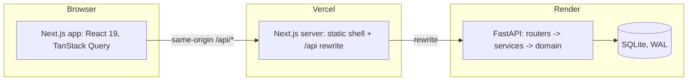
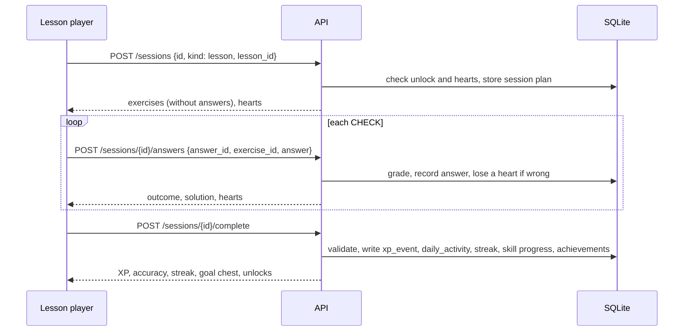

# Architecture

## Overview

- The **frontend** renders every screen and keeps server state in TanStack Query caches.
- The **API** is the single source of truth for game state: it grades answers, and it awards XP, hearts,
  streaks and gems. See [ADR 0002](adr/0002-server-authoritative-grading.md).
- **SQLite** stores course content and learner progress. Ledgers are the source of truth and totals are
  cached. See [ADR 0006](adr/0006-ledgers-and-caches.md).

## Backend layers

| Layer | Folder | Responsibility |
|---|---|---|
| API | `app/api/v1` | HTTP routing, request validation (Pydantic), dependency injection (`get_db`, `get_clock`, `get_current_user`) |
| Schemas | `app/schemas` | The public contract: request and response models, also exported as OpenAPI |
| Services | `app/services` | One function per use case. Each runs in a single `BEGIN IMMEDIATE` transaction: settle lazy state, apply rules, write ledgers and caches |
| Domain | `app/domain` | Pure rules with no I/O: grading, XP, hearts, streak, goals, path state, leagues, achievements |
| Models | `app/models` | SQLAlchemy 2 ORM mapping of the 23 tables |
| Core | `app/core` | Settings, database engine and pragmas, clock, errors, logging |
| Seed | `app/seed` | YAML course content, validated and turned into rows; the sample learner, rivals and catalogue |

## A lesson, end to end

## Frontend structure

| Folder | Contents |
|---|---|
| `src/app/(main)` | Pages with the sidebar and right rail: learn, practice hub, leaderboard, quests, shop, profile, settings |
| `src/app/(session)` | Full-screen lesson, practice, legendary and timed sessions |
| `src/features/*` | Screen-level features: path, lesson player (reducer state machine, exercise registry), practice hub, leaderboard, shop, quests, profile, settings, demo tools |
| `src/components/ui` | Design-system primitives built on the CSS-variable tokens |
| `src/components/icons`, `mascot` | Original SVG artwork |
| `src/lib/api` | Typed API client and query hooks |
| `src/lib/sound`, `tts` | Web Audio sound effects and speech synthesis |

## Time

Every rule takes `now` from an injected clock. Demo tools can shift that clock to show streak and heart
behaviour. See [ADR 0004](adr/0004-injectable-clock-lazy-settlement.md).

## Decisions

See [`docs/adr`](adr) for the recorded decisions.
