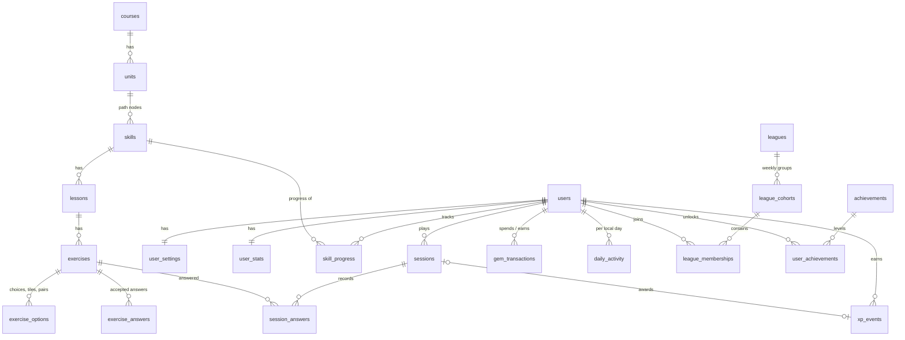

# Database schema

SQLite, 23 tables, created by Alembic migration `0001_initial`. The tables fall into five groups: course
**content**, **learners** and their state, lesson **sessions**, append-only **ledgers**, and the
gamification **catalogue**.

## Tables

| Group | Table | Purpose and key constraints |
|---|---|---|
| Content | `courses` | One row per language course. `is_available=0` rows show as "Coming soon". |
| | `units` | Ordered units in a section. `UNIQUE(course_id, position)`; colour enum. |
| | `skills` | Path nodes: `lesson`, `chest`, `practice` or `unit_review`. Ordered within a unit; a chest must have `chest_gems`. |
| | `lessons` | Ordered lessons of a skill (3 for lesson skills, 1 for a unit review). |
| | `exercises` | Ordered exercises with a type `CHECK` over the 8 supported types, the prompt, source text, TTS text and the "new word" flag. |
| | `exercise_options` | Choices (`is_correct`), word-bank tiles (`answer_position`, NULL for distractors) and match pairs (`pair_key`). |
| | `exercise_answers` | Accepted typed answers; the canonical answer is flagged. |
| Learners | `users` | The default learner plus seeded league rivals (`is_bot`, `bot_pace_xp`). Stores the time zone. |
| | `user_settings` | Sound, animations, motivational messages, listening exercises, theme, daily goal (`CHECK IN (1,10,20,30,50)`). |
| | `user_stats` | Current state: hearts (0–5) with the regeneration anchor, streak, freezes (0–2), league tier, and cached `xp_total` and `gems`. |
| | `skill_progress` | Per learner and skill: lessons completed and crown level (0–2), with completed and legendary timestamps. |
| Sessions | `sessions` | One per lesson attempt. Client UUID key, kind, status, frozen exercise plan (JSON), stored completion result (JSON). |
| | `session_answers` | Every graded answer. `UNIQUE(session_id, answer_id)` makes submissions replay-safe. |
| Ledgers | `xp_events` | Every XP award, with its local date. `UNIQUE(session_id)`; a partial unique index allows one rival row per day. |
| | `gem_transactions` | Every gem change, with its reason and balance after. A partial unique index `(user_id, reason, ref)` blocks double rewards. |
| | `daily_activity` | Per learner and local day: XP, sessions, the goal in force, the time the goal was met, the streak status (`extended` or `frozen`). |
| Catalogue | `leagues` | 10 tiers with promotion and demotion counts and top-3 rewards. |
| | `league_cohorts` / `league_memberships` | Weekly groups of 30 learners, with final rank and outcome once the week closes. |
| | `achievements` / `user_achievements` | Achievement definitions with thresholds, and each learner's level and progress. |
| | `shop_items` | Heart refill, streak freeze, legendary entry, unlimited hearts (unavailable). |
| | `app_settings` | Key/value settings, used for the simulated clock offset. |

## Conventions

- Content tables use **integer primary keys plus a unique slug**, so re-seeding is stable. Sessions use
  **client-generated UUIDs**.
- **Timestamps** are UTC ISO-8601 text. **Local dates** are `YYYY-MM-DD` in the learner's time zone.
- **Enums** are enforced with `CHECK` constraints and **JSON columns** with `CHECK(json_valid(...))`.
- Every foreign key has an explicit `ON DELETE` rule: `CASCADE` for owned rows, `SET NULL` for
  references that may outlive their target.
- Every foreign key and every filter or sort column is indexed.
- `user_stats.xp_total` and `user_stats.gems` are caches of the ledgers. They are written in the same
  transaction and checked by tests. See [ADR 0006](adr/0006-ledgers-and-caches.md).
