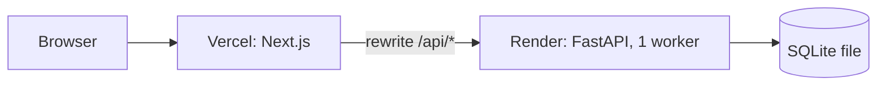

# Deployment

The frontend runs on **Vercel** and the API with its SQLite database on **Render**. The browser only ever
calls the Vercel origin; `next.config.ts` rewrites `/api/*` to the API service, so there is no CORS, no
public API URL to configure in the client, and the session cookie is first-party.



## API on Render

The API runs as a Render web service on a paid instance type (Starter or above) with a persistent
disk, so learner progress survives deploys and restarts and the service never sleeps.

1. **New → Web Service** and pick this repository.
2. Settings:
   - Language: Docker
   - Branch: `main`
   - Region: Singapore (next to the Vercel region `sin1`)
   - Root directory: `backend`
   - Dockerfile path: `./Dockerfile`
   - Instance type: Starter
   - Health check path: `/api/health`
3. **Disk:** name `data`, mount path `/var/data`, size 1 GB.
4. Environment variables:

   | Name | Value |
   |---|---|
   | `DATABASE_URL` | `sqlite:////var/data/app.db` (four slashes: an absolute path on the disk) |
   | `APP_ENV` | `production` (marks the session cookie `Secure`) |
   | `SECRET_KEY` | **Required.** A long random string, e.g. from `python -c "import secrets; print(secrets.token_urlsafe(32))"`. Without it cookies are signed with the public development key, and the API logs a warning at start-up |
   | `DEMO_TOOLS` | `true` (enables the simulated clock and the data reset used in the demo) |
   | `LOG_LEVEL` | `info` |

5. Deploy. The Docker image's start command runs `alembic upgrade head`, then
   `python -m app.seed --if-empty` (a no-op once the disk holds a seeded database), then `uvicorn`
   with one worker on `$PORT`, trusting the proxy's forwarded headers. Check
   `https://<service>.onrender.com/api/health`, which should return
   `{"status":"ok","db":"ok","seeded":true,...}`.

### Backups

Render snapshots the disk daily and keeps snapshots for at least 7 days. For a manual copy, open a
shell on the service and run
`python -c "import sqlite3; s=sqlite3.connect('/var/data/app.db'); d=sqlite3.connect('/var/data/backup.db'); s.backup(d)"`.
Never copy the live file directly, because changes still in the WAL file would be lost.

## Frontend on Vercel

1. **Add New → Project** and import the repository. Set the root directory to `frontend`; the
   framework preset is Next.js, and Node 24 comes from `engines` in `package.json`. `vercel.json`
   pins the functions to the `sin1` (Singapore) region.
2. Environment variables, for all environments:

   | Name | Value |
   |---|---|
   | `API_ORIGIN` | `https://<service>.onrender.com` |
   | `NEXT_PUBLIC_DEMO_TOOLS` | `true` (`false` hides the Demo tools section) |

3. Deploy. `API_ORIGIN` is read at build time for the rewrites, so redeploy after changing it. A
   production build fails if it is missing. Surrounding spaces or quotes and trailing slashes pasted
   into the value are removed, so `"https://<service>.onrender.com/"` works too.

## Smoke test

```bash
curl -s https://<app>.vercel.app/api/health                     # status ok, seeded true
curl -sI https://<app>.vercel.app/login | grep -i x-robots-tag   # noindex, nofollow
curl -s -D - -o /dev/null https://<app>.vercel.app/api/v1/me | grep -i -e "^HTTP" -e cache-control   # 401, no-store
```

Then open the app: it should redirect to `/login`, and picking a learner should open the learning
path.

**Persistence check:**
1. Finish a lesson.
2. Restart the Render service.
3. Reload. XP, streak and hearts should be unchanged.
