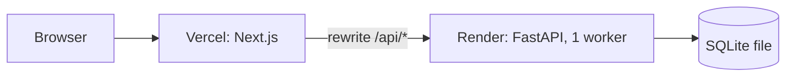

# Deployment

The frontend runs on **Vercel** and the API with its SQLite database on **Render**. The browser only ever
calls the Vercel origin; `next.config.ts` rewrites `/api/*` to the API service, so there is no CORS, no
public API URL to configure in the client, and the session cookie is first-party.



## API on Render

The live demo runs on Render's **free** instance type. Free web services have no persistent disk:
the SQLite file lives on the instance's own filesystem and is lost on every redeploy or restart, and
when the idle service spins down (after about 15 minutes without traffic). Because the start command
migrates and seeds an empty database, the API always comes back with the four sample learners in
their starting state, but any progress made since is gone. The first request after a spin-down also
waits for the service to start, which can take up to a minute.

For progress that survives, use a paid instance with a persistent disk (see below).

1. **New → Web Service** and pick this repository.
2. Settings:
   - Language: Docker
   - Branch: `main`
   - Region: Singapore (next to the Vercel region `sin1`)
   - Root directory: `backend`
   - Dockerfile path: `./Dockerfile`
   - Instance type: Free
   - Health check path: `/api/health`
3. Environment variables:

   | Name | Value |
   |---|---|
   | `APP_ENV` | `production` (marks the session cookie `Secure`) |
   | `SECRET_KEY` | **Required.** A long random string, e.g. from `python -c "import secrets; print(secrets.token_urlsafe(32))"`. Without it cookies are signed with the public development key, and the API logs a warning at start-up |
   | `DEMO_TOOLS` | `true` (enables the simulated clock and the data reset used in the demo) |
   | `LOG_LEVEL` | `info` |

   Leave `DATABASE_URL` unset on the free plan; the database then lives at `/app/data/app.db`
   inside the container.
4. Deploy. The Docker image's start command runs `alembic upgrade head`, then
   `python -m app.seed --if-empty` (a no-op when the database is already seeded), then `uvicorn` with
   one worker on `$PORT`, trusting the proxy's forwarded headers. Check
   `https://<service>.onrender.com/api/health`, which should return
   `{"status":"ok","db":"ok","seeded":true,...}`.

### Keeping the data

On a paid instance type (Starter or above):

1. Add a disk: name `data`, mount path `/var/data`, size 1 GB.
2. Set `DATABASE_URL` to `sqlite:////var/data/app.db` (four slashes: an absolute path).
3. Redeploy. The first start seeds the disk; later starts leave it alone.

The service then also stays awake. Render snapshots the disk daily and keeps snapshots for at least
7 days. For a manual copy, open a shell on the service and run
`python -c "import sqlite3; s=sqlite3.connect('/var/data/app.db'); d=sqlite3.connect('/var/data/backup.db'); s.backup(d)"`.
Never copy the live file directly, because changes still in the WAL file would be lost.

## Frontend on Vercel

1. **Add New → Project** and import the repository. Set the root directory to `frontend`; the
   framework preset is Next.js, and Node 24 comes from `engines` in `package.json`. `vercel.json`
   pins the functions to the `sin1` (Singapore) region.
2. Environment variables, for all environments:

   | Name | Value |
   |---|---|
   | `API_ORIGIN` | `https://<service>.onrender.com` |
   | `NEXT_PUBLIC_DEMO_TOOLS` | `true` (`false` hides the Demo tools section) |

3. Deploy. `API_ORIGIN` is read at build time for the rewrites, so redeploy after changing it. A
   production build fails if it is missing. Surrounding spaces or quotes and trailing slashes pasted
   into the value are removed, so `"https://<service>.onrender.com/"` works too.

## Smoke test

```bash
curl -s https://<app>.vercel.app/api/health                     # status ok, seeded true
curl -sI https://<app>.vercel.app/login | grep -i x-robots-tag   # noindex, nofollow
curl -s -D - -o /dev/null https://<app>.vercel.app/api/v1/me | grep -i -e "^HTTP" -e cache-control   # 401, no-store
```

Then open the app: it should redirect to `/login`, and picking a learner should open the learning
path.

**Persistence check** (paid instance with a disk only):
1. Finish a lesson.
2. Restart the Render service.
3. Reload. XP, streak and hearts should be unchanged.

## Free alternative with persistence

PythonAnywhere's free tier keeps files on a persistent disk:
1. Install the backend requirements into a virtualenv.
2. Wrap the app for WSGI with `a2wsgi`: `application = ASGIMiddleware(app)`.
3. Set the environment variables above, and run `alembic upgrade head` and the seed command once.
4. Point Vercel's `API_ORIGIN` to `https://<user>.pythonanywhere.com`.

The trade-offs: one worker, manual deploys, and the app has to be extended monthly.
