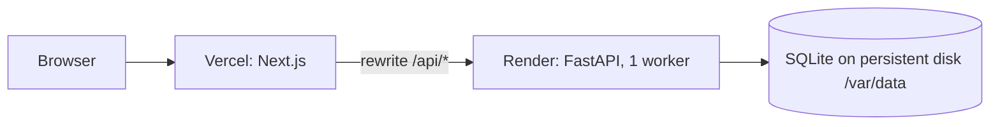

# Deployment

The frontend runs on **Vercel** and the API with its SQLite database on **Render**. The browser only ever
calls the Vercel origin; `next.config.ts` rewrites `/api/*` to the API service, so there is no CORS and
no public API URL to configure in the client.



## API on Render

1. **New → Web Service** and pick this repository.
2. Settings:
   - Language: Docker
   - Branch: `main`
   - Region: Singapore
   - Root directory: `backend`
   - Dockerfile path: `./Dockerfile`
   - Instance type: Starter. Free instances sleep, and their filesystem is wiped.
   - Disk: name `data`, mount path `/var/data`, size 1 GB.
   - Health check path: `/api/health`.
3. Environment variables:

   | Name | Value |
   |---|---|
   | `DATABASE_URL` | `sqlite:////var/data/app.db` (four slashes: absolute path) |
   | `APP_ENV` | `production` |
   | `DEMO_TOOLS` | `true` (enables the simulated clock used in the demo) |
   | `LOG_LEVEL` | `info` |

4. Deploy. The start command runs `alembic upgrade head`, then `python -m app.seed --if-empty` (a no-op
   once seeded), then `uvicorn`. Check `https://<service>.onrender.com/api/health`, which should return
   `{"status":"ok","db":"ok","seeded":true,...}`.

## Frontend on Vercel

1. **Add New → Project** and import the repository. Set the root directory to `frontend`.
2. Environment variables, for all environments:

   | Name | Value |
   |---|---|
   | `API_ORIGIN` | `https://<service>.onrender.com` |
   | `NEXT_PUBLIC_DEMO_TOOLS` | `true` |

3. Deploy. `API_ORIGIN` is read at build time for the rewrites, so redeploy after changing it.

## Smoke test

```bash
curl -s https://<app>.vercel.app/api/health               # status ok, seeded true
curl -sI https://<app>.vercel.app/ | grep -i x-robots-tag  # noindex
curl -sI https://<app>.vercel.app/api/v1/me | grep -i cache-control   # no-store
```

**Persistence check:**
1. Finish a lesson.
2. Restart the Render service.
3. Reload. XP, streak and hearts should be unchanged.

## Backups

- Render snapshots the disk daily and keeps snapshots for at least 7 days.
- For a manual copy, open a shell on the service and run
  `python -c "import sqlite3; s=sqlite3.connect('/var/data/app.db'); d=sqlite3.connect('/var/data/backup.db'); s.backup(d)"`.
  Never copy the live file directly, because changes still in the WAL file would be lost.

## Free alternative

PythonAnywhere's free tier keeps files on a persistent disk:
1. Install the backend requirements into a virtualenv.
2. Wrap the app for WSGI with `a2wsgi`: `application = ASGIMiddleware(app)`.
3. Run `alembic upgrade head` and the seed command once.
4. Point Vercel's `API_ORIGIN` to `https://<user>.pythonanywhere.com`.

The trade-offs: one worker, manual deploys, and the app has to be extended monthly.
